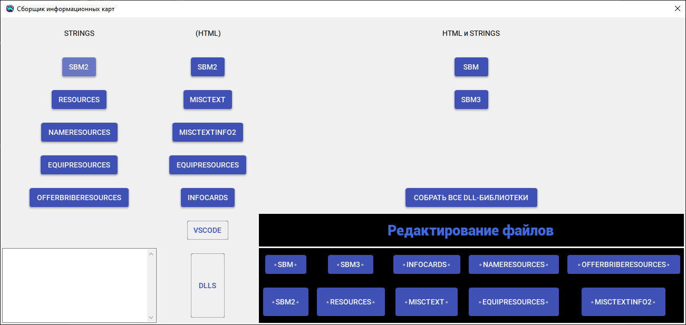

<h1 align="center">🧩 CompilerInfocardsUI</h1>

<p align="center">
  GUI-панель управления для сборки и редактирования <b>информационных DLL-карт</b> в <b>Freelancer (2003)</b> / <b>Lizerium</b>
</p>

<p align="center">
  
  
  
  
  
  
  
  
</p>

<div align="center" style="margin: 20px 0; padding: 10px; background: #1c1917; border-radius: 10px;">
  <strong>🌐 Язык: </strong>
  
  <span style="color: #F5F752; margin: 0 10px;">
    ✅ 🇷🇺 Русский (текущий)
  </span>
  | 
  <a href="./README.md" style="color: #0891b2; margin: 0 10px;">
    🇺🇸 English
  </a>
</div>

---

> [!NOTE]
> Этот проект является частью экосистемы **Lizerium** и относится к направлению:
>
> - [`Lizerium.Tools.Structs`](https://github.com/Lizerium/Lizerium.Tools.Structs)
>
> Если вы ищете связанные инженерные и вспомогательные инструменты, начните оттуда.

## 🌌 Что это такое

**CompilerInfocardsUI** — это **универсальная Windows GUI-панель**, которую я написал для централизованной работы с **информационными картами Freelancer**:



- названиями объектов
- описаниями предметов
- текстовыми ресурсами
- HTML-представлениями инфокарт
- DLL-библиотеками игры

По сути, это **HUB-интерфейс** над моими внутренними утилитами и пайплайном сборки, который позволяет **быстро открывать нужные файлы**, **редактировать их** и **компилировать итоговые DLL** через внешний инструмент `frc.exe`.

---

## ❓ Зачем я это написал

Во время разработки и поддержки контента для **Lizerium / Freelancer** у меня накопилась большая файловая структура с:

- сотнями вариантов текстовых карт
- разными версиями названий и описаний
- дублями файлов в разных папках
- разными DLL-целями под разные игровые сценарии

Со временем ручная работа с этим стала просто неудобной.

Поэтому я сделал отдельную **панель управления**, которая:

- собирает все точки входа в одном месте
- открывает нужные файлы без ручного поиска
- позволяет быстро запускать компиляцию нужных DLL
- убирает хаос из файловой структуры

---

## ⚙️ Что умеет

### Сборка DLL-ресурсов

Приложение умеет запускать команды сборки для различных игровых библиотек:

#### `STRINGS`

- `SBM2`
- `RESOURCES`
- `NAMERESOURCES`
- `EQUIPRESOURCES`
- `OFFERBRIBERESOURCES`

#### `HTML`

- `SBM2`
- `MISCTEXT`
- `MISCTEXTINFO2`
- `EQUIPRESOURCES`
- `INFOCARDS`

#### `HTML + STRINGS`

- `SBM`
- `SBM3`

#### Полная сборка

- сборка **всех DLL-библиотек сразу**

---

## 🛠 Возможности интерфейса

Программа позволяет:

- открывать исходные файлы нужной DLL-библиотеки
- открывать папку с DLL
- открывать проект через **VS Code**
- запускать редактирование конкретных файлов
- запускать сборку конкретных библиотек
- запускать полную пакетную компиляцию
- логировать выполнение всех действий в окне приложения

---

## 🧠 Как это работает

- Вся логика работы завязана на файл: [configs.json](CompilerInfocardsUI/CompilerInfocardsUI/configs.json)
  - Пример

    ```json
    {
    	"SBM2_STRINGS": {
    		"ExePath": "frc.exe",
    		"Arguments": "SBM2\\STRINGS\\input.txt"
    	},
    	"VSCODE": {
    		"ExePath": "code",
    		"Arguments": "."
    	},
    	"RootDLLS": {
    		"ExePath": "explorer.exe",
    		"Arguments": "DLLS"
    	}
    }
    ```

  - Редактируйте обозначайте свои пути до `frc.exe` от Adoxa и файлов генерации

## Thx

> Thanks for the source code which helped me understand the issue of information cards.

- http://adoxa.altervista.org/freelancer/tools.html#frc - Adoxa
